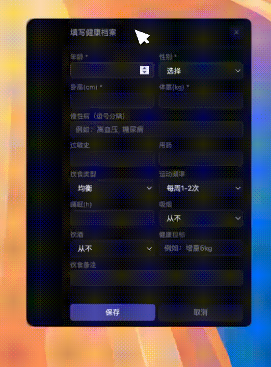

# HealthMate

<p align="center">
  
</p>

HealthMate is a personal healthcare AI companion that lives on your desktop as a cute pet. It is built with FastAPI + LangGraph on the backend and an Electron desktop pet on the frontend.

The pet talks with you, remembers your health profile, archives daily conversations, offers proactive reminders, and supports hands-free voice conversation.

## Demo

<p align="center">
  
  <br><em>Agent function demo</em>
</p>

<p align="center">
  
  <br><em>Reminder demo</em>
</p>

## Features

- **Desktop pet** with expressive rounded-rectangle eyes, a retro CRT scanline screen effect, and comic-style speech bubbles.
- **Multi-provider chat** - OpenAI, DeepSeek, Qwen, Ollama, or any OpenAI-compatible endpoint. Model configs are managed in the UI and stored locally.
- **Voice conversation mode** - continuous listening with speech detection and automatic silence-based cutoff (3s), so you can talk without pressing a button.
- **Speech recognition & synthesis** - faster-whisper (base model) for ASR, edge-tts for TTS with sentence-by-sentence streaming to reduce latency.
- **Multi-agent LangGraph pipeline** - Data Analyzer (supervisor), Memory Agent (archiver), and Knowledge Agent (profile + web search tools).
- **Health profile** - age, gender, height, weight, chronic conditions, allergies, medications, diet, exercise, sleep, smoking, drinking, and goals.
- **Daily archives** - each day's conversation is summarized automatically with key points, mood, concerns, and recommendations.
- **Archive search** - find past conversations by date and keyword.
- **Health dashboard** - trend charts based on archived conversations.
- **Proactive reminders** - the pet checks in after long idle periods, at mealtimes, and near bedtime.

## Tech Stack

- Python 3.12+
- FastAPI
- LangGraph / LangChain Core
- Pydantic
- SQLite + SQLAlchemy
- faster-whisper (ASR)
- edge-tts (TTS)
- Electron (desktop pet)
- Chart.js (dashboard)

## Project Structure

```text
HealthMate/
├── app/
│   ├── agent/          # LangGraph multi-agent pipeline
│   │   ├── graph.py    # Graph assembly: supervisor -> tools -> archiver
│   │   ├── state.py    # Agent state schema
│   │   └── nodes/      # supervisor (Data Analyzer), archiver (Memory Agent)
│   ├── agents/         # LangChain tools (profile lookup, web knowledge search)
│   ├── api/            # FastAPI routers (chat, voice, profile, archive)
│   ├── core/           # Config, logging, exceptions
│   ├── database/       # SQLAlchemy models, CRUD, SQLite connection
│   ├── llm/            # Unified LLM provider abstraction
│   ├── schemas/        # Pydantic request/response models
│   ├── voice/          # faster-whisper ASR + edge-tts TTS
│   └── main.py         # FastAPI app entry
├── electron/           # Desktop pet wrapper
│   ├── main.js         # Electron main process
│   ├── preload.js      # IPC bridge
│   └── start-pet.sh    # One-command launcher
├── static/             # Frontend (index.html)
├── tests/              # Pytest suite
├── .env.example        # Environment variable template
├── pyproject.toml
└── uv.lock
```

## Getting Started

### Prerequisites

- Python 3.12+
- [uv](https://docs.astral.sh/uv/) (recommended) or pip
- Node.js + npx (only for the Electron desktop pet)

### Install

```bash
cd HealthMate
uv sync --extra dev
```

Or with pip:

```bash
python -m venv .venv
source .venv/bin/activate
pip install -e ".[dev]"
```

### Configure

```bash
cp .env.example .env
```

Edit `.env` and fill in at least one LLM provider key. You can also add multiple models later from the settings panel in the app.

### Run

Backend only (also accessible from a browser at `http://localhost:8000`):

```bash
uv run uvicorn app.main:app --host 0.0.0.0 --port 8000
```

Desktop pet (starts the backend automatically):

```bash
cd electron
bash start-pet.sh
```

### Test

```bash
uv run pytest tests/ -q
```

## Environment Variables

| Variable | Description | Default |
| --- | --- | --- |
| `LLM_PROVIDER` | Default provider: `openai`, `deepseek`, `qwen`, `ollama` | `openai` |
| `OPENAI_API_KEY` | OpenAI / compatible API key | - |
| `OPENAI_BASE_URL` | OpenAI / compatible base URL | `https://api.openai.com/v1` |
| `OPENAI_MODEL` | OpenAI model name | `gpt-4o-mini` |
| `DEEPSEEK_API_KEY` | DeepSeek API key | - |
| `DEEPSEEK_BASE_URL` | DeepSeek base URL | `https://api.deepseek.com` |
| `DEEPSEEK_MODEL` | DeepSeek model name | `deepseek-chat` |
| `QWEN_API_KEY` | Qwen (DashScope) API key | - |
| `QWEN_BASE_URL` | Qwen compatible base URL | `https://dashscope.aliyuncs.com/compatible-mode/v1` |
| `QWEN_MODEL` | Qwen model name | `qwen-turbo` |
| `OLLAMA_BASE_URL` | Ollama base URL | `http://localhost:11434` |
| `OLLAMA_MODEL` | Ollama model name | `llama3.2` |
| `APP_HOST` | Backend bind host | `0.0.0.0` |
| `APP_PORT` | Backend bind port | `8000` |
| `LOG_LEVEL` | Logging level | `INFO` |

## API

All routes are prefixed with `/api/v1`.

| Method | Endpoint | Description |
| --- | --- | --- |
| `POST` | `/chat` | Send a message and receive a reply |
| `POST` | `/chat/stream` | Stream a chat reply token-by-token (SSE) |
| `POST` | `/asr` | Transcribe an audio file (WAV / WebM / MP3) to text |
| `POST` | `/tts` | Synthesize text into MP3 audio |
| `GET` | `/profile` | Get the user's health profile |
| `PUT` | `/profile` | Create or update the health profile |
| `DELETE` | `/profile` | Delete the health profile |
| `GET` | `/profile/check` | Check whether a profile exists |
| `GET` | `/archives` | Search daily archives by keyword, year, month |
| `GET` | `/archives/{date}` | Get a full archive for a date |
| `DELETE` | `/archives/{date}` | Delete an archive |
| `GET` | `/health` | Health check |

## Agent Architecture

The conversation runs through a compiled LangGraph state graph:

```text
START
  │
  ▼
supervisor (Data Analyzer)
  │
  ├─ tool call? ──► tools (profile lookup / knowledge search)
  │                     │
  │                     └──► back to supervisor
  │
  ▼
archiver (Memory Agent)
  │
  ▼
END
```

- **Data Analyzer (supervisor)** - the main conversational agent. It decides whether to call tools and responds to the user.
- **Knowledge Agent (tools)** - provides the user's health profile and searches authoritative public health references when needed.
- **Memory Agent (archiver)** - runs after each conversation turn and writes a daily archive with a summary, key points, mood, concerns, and recommendations.

## Roadmap

- Richer long-term memory and multi-day trend analysis
- Retrieval-augmented generation (RAG) over personal health records
- More proactive health interventions and scheduled check-ins
- Extend the multi-agent system with specialized planners and summarizers
